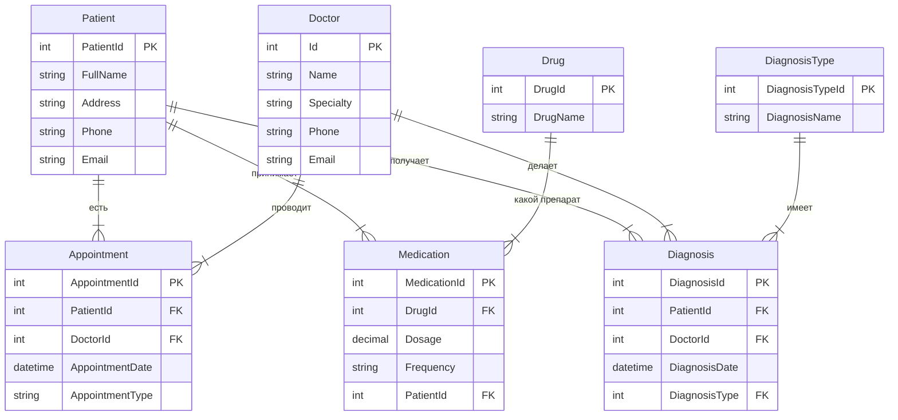
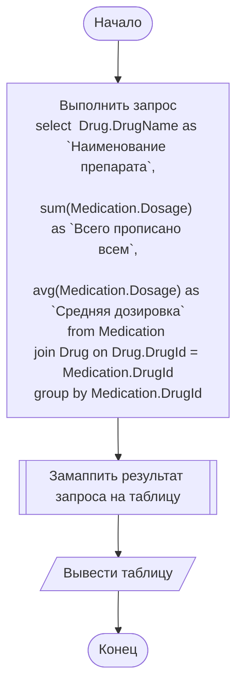

# Проект 2
## Предметная область

> [!NOTE]
> Медицина и здравоохранение: Создание модулей для управления медицинскими записями пациентов, расписанием приемов, лекарственными препаратами, медицинской диагностикой и анализом данных.

## ER-диаграмма

<!-- TODO Упорядочить таблицы -->

## Блок-схемы
###  Расчет количества назначенных препаратов
> [!NOTE]
> Сколько определенного препарата было назначено и какая средняя дозировка этого препарата

## Расчет загруженности
> [!NOTE]
> Когда на неделе больше всего и меньше всего пациентов записано.
